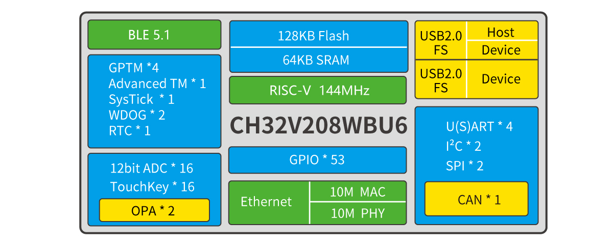
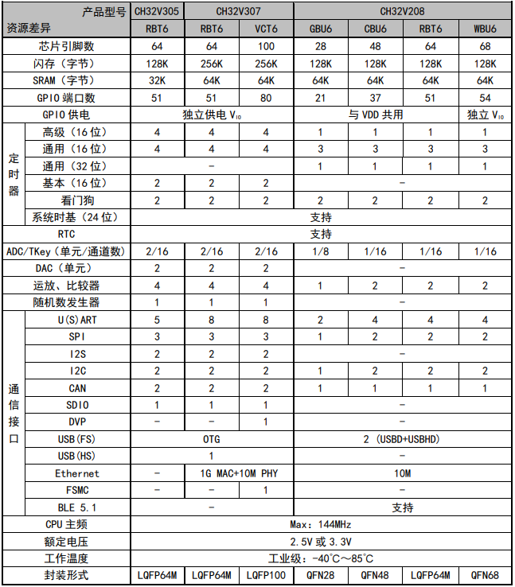
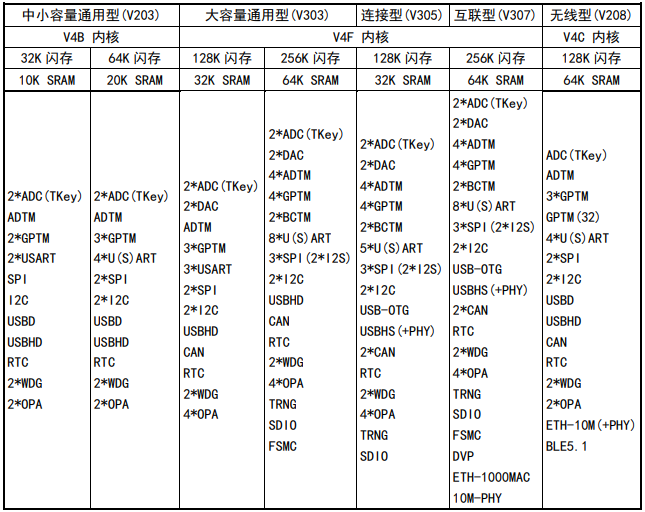

# [CH32V208](https://github.com/SoCXin/CH32V208)

* [WCH](http://www.wch.cn/)：[RISC-V](https://github.com/SoCXin/RISC-V)
* [L4R4](https://github.com/SoCXin/Level)：144 MHz

## [简介](https://github.com/SoCXin/CH32V208/wiki)

[CH32V208](https://github.com/SoCXin/CH32V208) 系列是基于32位RISC-V设计的无线型微控制器，配备了硬件堆栈区、快速中断入口，在标准RISC-V基础上大大提高了中断响应速度。搭载V4C内核，加入内存保护单元，同时降低硬件除法周期。片上集成2Mbps低功耗蓝牙BLE 通讯模块、10M以太网MAC+PHY模块、USB2.0全速设备+主机/设备接口、CAN控制器等。

#### 关键特性

* 10M以太网控制器（MAC+PHY）
* 4个USART接口
* 低功耗蓝牙5.1
* 64KB SRAM，128KB Flash
* 2组运放比较器

### [资源收录](https://github.com/SoCXin)

* [参考资源](src/)
* [参考文档](docs/)
* [参考工程](project/)

### [选型建议](https://github.com/SoCXin)

[CH32V208](https://github.com/SoCXin/CH32V208)

* LQFP64M
* QFN68
* QFN48
* QFN28 (4*4mm)

### [探索芯世界 www.SoC.xin](http://www.SoC.Xin)
